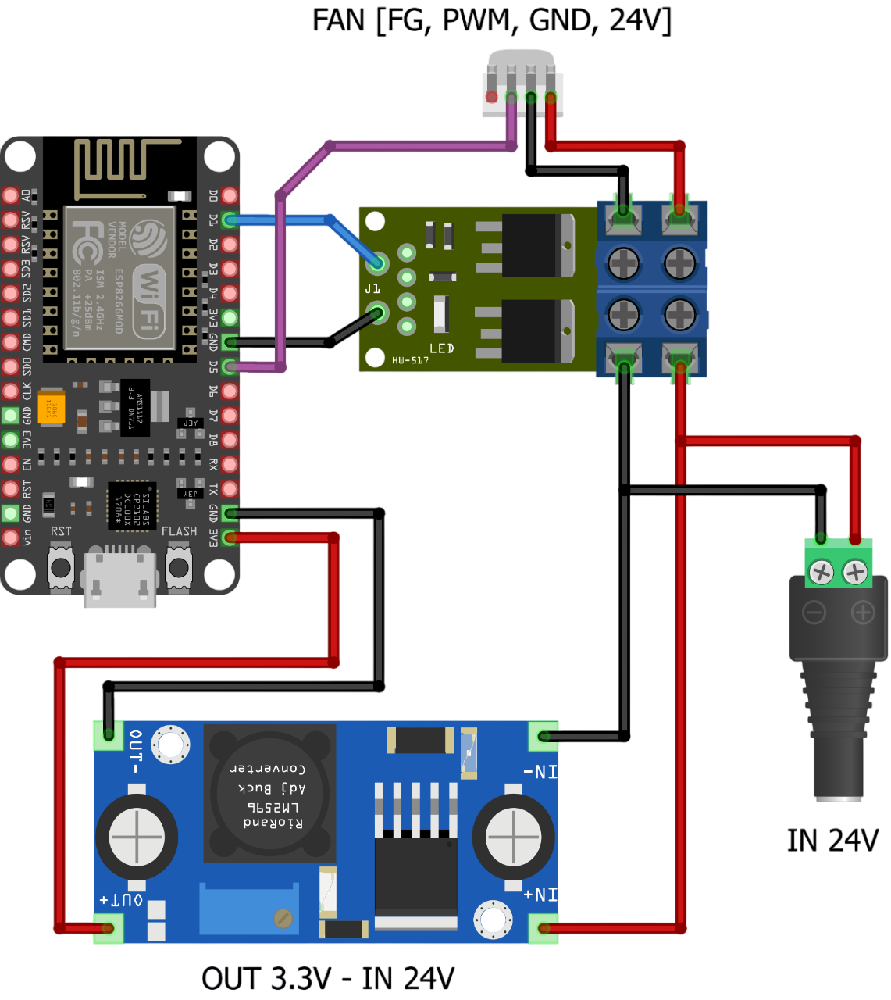

# IKEA UPPÅTVIND Air Purifier
IKEA UPPÅTVIND Air Purifier - ESPHome/Arduino - ESP8266 &amp; XY-MOS &amp; LM2596

## Circuit Diagram



[Fritzing Breadboard → IKEA UPPATVIND Air Purifier.fzz](IKEA%20UPPATVIND%20Air%20Purifier.fzz)

### Components

The Purifier has a 4-pin PWM fan with +24VDC, 0.5A.   
The pins are POWER, GND, PWM, FG.   
PWM is a control pin for pulse width modulation and FG is the tacho pin for feedback purposes.   
The fan operates with a constant duty cycle of 50% and variable frequency between ca. 1-300Hz.

#### ESP8266 NodeMCU
Wi-Fi-enabled microcontroller board that runs your code and controls other electronics

#### XY-MOS
MOSFET power switch module that lets the ESP8266 safely turn high-voltage or high-current loads on and off

#### LM2596
Buck converter that steps down higher voltages (like 24 V) to lower voltages (like 3.3 V) to safely power your electronics

## ESPHome
```
ikea-air-purifier.ino

# your wifi
const char* ssid = "";
const char* password = "";
```

## Arduino
```
ikea-air-purifier.yaml

# your Home Assistant API
api:
  encryption:
    key: "<key>"

ota:
  - platform: esphome
    password: "<password>"
```

### Links
1. https://www.ikea.com/se/en/p/uppatvind-air-purifier-10498221/
2. https://github.com/horvathgergo/esp8266-for-fornuftig
3. https://github.com/maxmacstn/ESP32-IKEA-UPPATVIND
4. https://github.com/hakaneriksson/air-purifier-card
